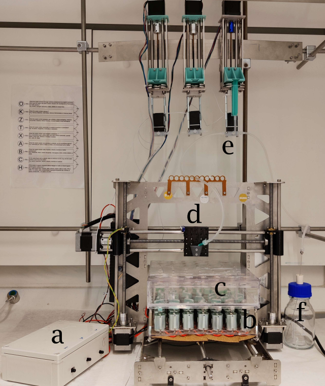

# Automatic Synthesis Machine

The purpose of this project is to create a low cost open-source machine for the automation of laboratory work.
This github contains the first rendition of the ASM. To see the following work of this group and all the upgrades on the ASM, [follow this link](https://github.com/AUautosynth/AU-ASM).


## Description

The machine (ASM) consists of a modified 3D printer that can run up to 45 stirred batch reactions at 5.5 ml 
capacity mixing up to 5 different solutions in inert atmosphere. The machine can be seen below.



The ASM can be seen in the picture above where ***a*** is the PWM controllers for the stirrers, ***b*** is the stirrers, 
***c*** is an inert vial box to work within a controlled atmosphere, ***d*** is the dosing head, ***e*** is the pumps which are upheld by a steel beam secured to monkey bars
in the fumehood and finally ***f*** is the bluecap flask working as a solution reservoir.

The estimated cost of the machine is below 2500 EUR, see BoM under assets.
The layout and controlling python scrpit makes it easy to create your own protocols but a standard mixing protocol as well as a 
calibration protocol is already made. The software in this repository can either be used as a plug and play solution, 
where a experimental protocol file (.xlsx) is exectued through the ASM program.exe. 
The software can also be used as a python module, allowing full freedom for the user. The current machine is made up in modules, so that its
 capabilities can be interchanged based on your needs.

### Modules
The modules of the ASM includes:
- [x] Dosing
- [x] Stirring
- [x] Atmospheric control

## Getting Started

### Dependencies

* Latest [arduino IDE](https://www.arduino.cc/en/software).
* [Python 3.9.7](https://www.python.org/downloads/) or higher.
* Excel but a similar program for modifying .xlsx files like [Apache Calc](https://www.openoffice.org/product/calc.html) can also be used.
* For script usage we recommend using either the latest version of [spyder](https://www.spyder-ide.org/) or [pycharm community edition](https://www.jetbrains.com/pycharm/download/#section=windows).
* A 3D printer with a modifiable PCB ([Preferably Ramps 1.4](https://reprap.org/wiki/RAMPS_1.4))
* All necessary CAD and STL files can be found under assets

### Installing

- Download the repository as a .zip file and extract it into a folder.
- Install the modified Marlin firmware on the 3D printer PCB found in the firmware folder.

### Using the code as a module

To use the ASMlibrary as a module take the 'ASMlibrary.py' file and put it into the same folder as the .py file you want to use as the "run-file"
An example of a standard dosage protocol usage is shown below:
```
ASMlibrary.start_sequence(syringe_size=10, pumps=3, offset=True, pump=True)

ASMlibrary.standard_dosage()

ASMlibrary.end_sequence(pumps=3)
```


### Using the machine
This shows a standard procedure for the operation of an experiment using the machine.

1. Create the experiment protocol from the excel template.
2. Add vials and tubing to the machine.
3. Prepare the stock solutions.
4. Run the python script and chose the excel file you have made.

## Authors
Jakob Saugbjerg (jrs@bce.au.dk)

Thorbjørn Jensen (tbj@bce.au.dk)

Mogens Hinge (hinge@bce.au.dk)

Martin Lahn (lahn@bce.au.dk)


## Version History

* 1.0
    * Initial Release

## License

MIT License

Copyright (c) 2023 Jakob Rørbæk Saugbjerg, Thorbjørn Bøgh Jensen, Mogens Hinge & Martin Lahn

Permission is hereby granted, free of charge, to any person obtaining a copy
of this software and associated documentation files (the "Software"), to deal
in the Software without restriction, including without limitation the rights
to use, copy, modify, merge, publish, distribute, sublicense, and/or sell
copies of the Software, and to permit persons to whom the Software is
furnished to do so, subject to the following conditions:

The above copyright notice and this permission notice shall be included in all
copies or substantial portions of the Software.

THE SOFTWARE IS PROVIDED "AS IS", WITHOUT WARRANTY OF ANY KIND, EXPRESS OR
IMPLIED, INCLUDING BUT NOT LIMITED TO THE WARRANTIES OF MERCHANTABILITY,
FITNESS FOR A PARTICULAR PURPOSE AND NONINFRINGEMENT. IN NO EVENT SHALL THE
AUTHORS OR COPYRIGHT HOLDERS BE LIABLE FOR ANY CLAIM, DAMAGES OR OTHER
LIABILITY, WHETHER IN AN ACTION OF CONTRACT, TORT OR OTHERWISE, ARISING FROM,
OUT OF OR IN CONNECTION WITH THE SOFTWARE OR THE USE OR OTHER DEALINGS IN THE
SOFTWARE.


